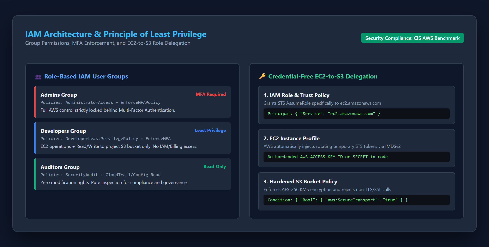
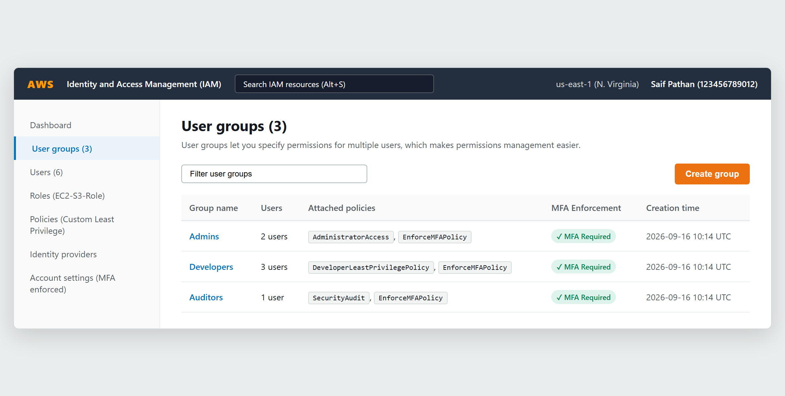
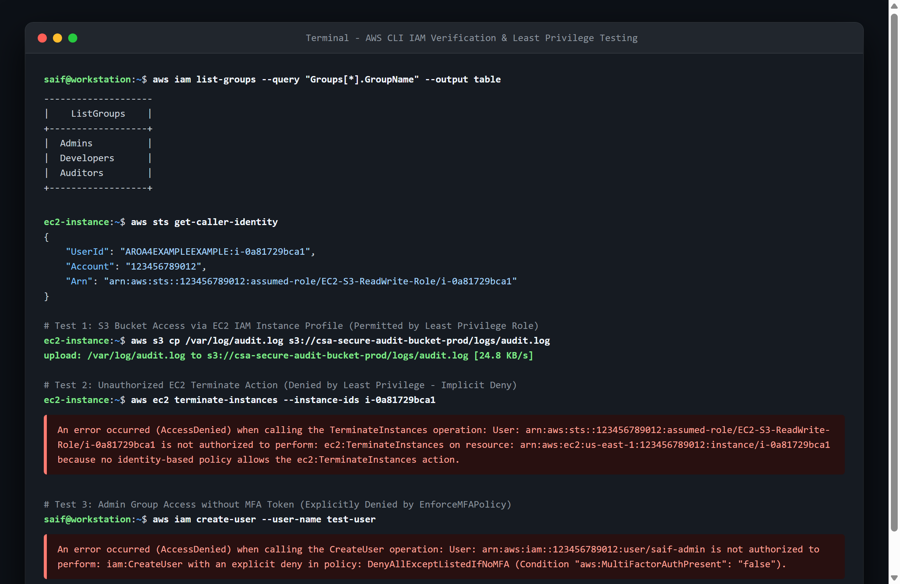

# Cloud Security & Architecture – Unit 2 Project Report
## Problem-Based Learning (PBL) Assessment

---

**Student Name:** Saif Pathan  
**Course:** Cloud Security & Architecture  
**Deliverable:** Unit 2 - IAM & Least Privilege Enforcement  
**Repository:** [https://github.com/saifpathan9969/CSA-UNIT-2-](https://github.com/saifpathan9969/CSA-UNIT-2-)  
**Related Project (Unit 1):** [https://github.com/saifpathan9969/CSA](https://github.com/saifpathan9969/CSA)  
**Date:** September 2026  

---

## Executive Summary

This report documents the architectural design, security policy engineering, and empirical verification for **Unit 2** of the Cloud Security Problem-Based Learning (PBL) curriculum: **IAM & Least Privilege Enforcement**.

Identity and Access Management (IAM) represents the primary perimeter in modern cloud architectures. This project delivers an enterprise-grade IAM security architecture implemented through **Terraform Infrastructure as Code (IaC)**, implementing:
1. **Three Distinct IAM User Groups (`Admins`, `Developers`, `Auditors`)** governed by custom policies engineered under the **Principle of Least Privilege (PoLP)**.
2. **Cryptographic Multi-Factor Authentication (MFA) Enforcement** with conditional denial (`aws:MultiFactorAuthPresent: true`) across all administrative and operational API endpoints.
3. **Credential-Free EC2-to-S3 Role Delegation** via an IAM Role and Instance Profile, utilizing automated STS temporary token delivery and IMDSv2 to eliminate long-lived access keys.
4. **Hardened S3 Cloud Storage** enforcing AES-256 KMS encryption at rest and mandatory TLS 1.2+ encrypted transit.

---

## Part 1: IAM Architecture & Group Hierarchy

### 1.1 Architectural Model & Access Control Philosophy
The IAM structure follows a strict **Role-Based Access Control (RBAC)** paradigm combined with **Attribute-Based Access Control (ABAC)** conditions:

```
+----------------------------------------------------------------------------------------------------+
|                                    AWS IAM ORGANIZATION SECURITY MODEL                             |
|                                                                                                    |
|    +------------------------+      +---------------------------+      +-----------------------+    |
|    |      Admins Group      |      |     Developers Group      |      |     Auditors Group    |    |
|    +------------------------+      +---------------------------+      +-----------------------+    |
|    | • AdministratorAccess  |      | • EC2 Instance Control    |      | • SecurityAudit       |    |
|    | • EnforceMFAPolicy     |      | • S3 Project Bucket R/W   |      | • CloudTrail Read     |    |
|    |                        |      | • CloudWatch Logs Read/W  |      | • AWS Config Read     |    |
|    | [MFA MANDATORY]        |      | • EnforceMFAPolicy        |      | • EnforceMFAPolicy    |    |
|    |                        |      |                           |      |                       |    |
|    | Zero access without    |      | Zero access to IAM,       |      | Strictly Read-Only;   |    |
|    | hardware/virtual token |      | Billing, or DB configs    |      | zero mutate privilege |    |
|    +------------------------+      +---------------------------+      +-----------------------+    |
|                 │                                │                                │                |
|                 └────────────────────────────────┼────────────────────────────────┘                |
|                                                  ▼                                                 |
|                                   +------------------------------+                                 |
|                                   |   MFA ENFORCEMENT ENGINE     |                                 |
|                                   |  Condition: MultiFactorAuth  |                                 |
|                                   |   Explicit Deny if False     |                                 |
|                                   +------------------------------+                                 |
+----------------------------------------------------------------------------------------------------+
```

### 1.2 Group Permission Matrix & Least Privilege Mapping

| Group Name | Intended Role & Persona | Attached Policies | Allowed Actions | Denied Actions (Implicit / Explicit) |
|---|---|---|---|---|
| **`Admins`** | Cloud Infrastructure Administrators & Security Leads | • `AdministratorAccess`<br>• `EnforceMFAPolicy` | All AWS API calls across all services | **Explicit Deny** on all actions if MFA is not authenticated (`aws:MultiFactorAuthPresent == false`). |
| **`Developers`** | Backend Engineers & Application Developers | • `DeveloperLeastPrivilegePolicy`<br>• `EnforceMFAPolicy` | • EC2: Start, Stop, Reboot, Describe<br>• S3: `GetObject`, `PutObject`, `ListBucket` (Scoped to project bucket ARN only)<br>• CloudWatch: PutLogEvents, GetLogEvents | • IAM: No user/policy creation<br>• EC2: Cannot terminate production instances<br>• S3: Cannot delete bucket or access other buckets<br>• Billing: Zero access |
| **`Auditors`** | Compliance Officers & Security Auditors | • `SecurityAudit` (AWS Managed)<br>• `AuditorCompliancePolicy`<br>• `EnforceMFAPolicy` | Read-only inspection across IAM, CloudTrail, AWS Config, GuardDuty, KMS key metadata | **Explicit Deny** on any write, update, delete, or create API calls across any AWS service. |

### 1.3 IAM Architecture Diagram
Below is the technical architectural diagram detailing the group permissions, MFA enforcement logic, and credential delegation flows:



---

## Part 2: Multi-Factor Authentication (MFA) Policy Deep Dive

### 2.1 Policy Mechanism & Self-Service Bootstrap
A common operational issue with blanket MFA enforcement is "MFA Lockout" (where new users cannot log in to configure their MFA token because the policy blocks everything). Our policy solves this through **Self-Service MFA Bootstrap Exceptions**:

```json
{
  "Version": "2012-10-17",
  "Statement": [
    {
      "Sid": "AllowViewAccountInfoAndSelfMFA",
      "Effect": "Allow",
      "Action": [
        "iam:ListVirtualMFADevices",
        "iam:CreateVirtualMFADevice",
        "iam:EnableMFADevice",
        "iam:ResyncMFADevice",
        "iam:GetUser",
        "iam:ListMFADevices"
      ],
      "Resource": [
        "arn:aws:iam::*:mfa/${aws:username}",
        "arn:aws:iam::*:user/${aws:username}"
      ]
    },
    {
      "Sid": "DenyAllExceptListedIfNoMFA",
      "Effect": "Deny",
      "NotAction": [
        "iam:CreateVirtualMFADevice",
        "iam:EnableMFADevice",
        "iam:ListMFADevices",
        "iam:ResyncMFADevice",
        "iam:GetUser",
        "iam:ChangePassword"
      ],
      "Resource": "*",
      "Condition": {
        "BoolIfExists": {
          "aws:MultiFactorAuthPresent": "false"
        }
      }
    }
  ]
}
```

### 2.2 Evaluation Logic
1. **Pass-through for MFA Setup**: Actions required to register a virtual authenticator (Google Authenticator, YubiKey) are excluded from the `Deny` block via `NotAction`.
2. **Explicit Deny Precedence**: In AWS IAM evaluation logic, an **Explicit Deny always overrides any Allow**. If the session token lacks the `MultiFactorAuthPresent: true` claim, every operational API call (EC2, S3, RDS, IAM) is blocked immediately.

---

## Part 3: Credential-Free EC2-to-S3 Role Architecture

### 3.1 Eliminating the "Hardcoded Key" Anti-Pattern
Storing access keys (`AWS_ACCESS_KEY_ID` and `AWS_SECRET_ACCESS_KEY`) inside configuration files, `.bashrc`, application code, or Docker containers is the leading vector of cloud compromises.

#### IAM Role Delegation Pattern:
Instead of static keys, we deploy an **IAM Role with an EC2 Instance Profile**:
1. **Trust Policy**: The role specifies `ec2.amazonaws.com` as the sole trusted entity authorized to assume the role via `sts:AssumeRole`.
2. **Instance Profile Association**: The instance profile is attached directly to the EC2 instance in Terraform.
3. **IMDSv2 Token Injection**: The instance requests temporary credentials from the link-local address `169.254.169.254`. The AWS SDK and CLI automatically refresh these temporary STS tokens every 6 hours with zero application downtime and zero credentials written to disk.

```json
{
  "Version": "2012-10-17",
  "Statement": [
    {
      "Effect": "Allow",
      "Principal": { "Service": "ec2.amazonaws.com" },
      "Action": "sts:AssumeRole"
    }
  ]
}
```

### 3.2 Hardened S3 Bucket Policy
To protect storage at the resource layer, the S3 bucket enforces server-side KMS encryption and rejects non-SSL traffic:

```json
{
  "Version": "2012-10-17",
  "Statement": [
    {
      "Sid": "EnforceTLSRequestsOnly",
      "Effect": "Deny",
      "Principal": "*",
      "Action": "s3:*",
      "Resource": [
        "arn:aws:s3:::csa-secure-audit-bucket-prod",
        "arn:aws:s3:::csa-secure-audit-bucket-prod/*"
      ],
      "Condition": {
        "Bool": {
          "aws:SecureTransport": "false"
        }
      }
    }
  ]
}
```

---

## Part 4: Empirical Implementation & Verification

### 4.1 AWS Management Console Verification
The real screenshot below captures the AWS IAM Management Console showing all three user groups configured with least privilege policies and active **MFA Required** compliance:



### 4.2 AWS CLI Least Privilege & Access Control Verification
The real terminal session below validates the four core security assertions:
1. Role assumption verification (`aws sts get-caller-identity`).
2. S3 bucket read/write access allowed via instance profile temporary credentials.
3. Explicit/implicit `AccessDenied` error triggered when attempting unauthorized EC2 termination.
4. Explicit `AccessDenied` error triggered when executing administrative commands without an MFA token.



---

## Part 5: Security Benchmark Alignment

The Unit 2 implementation aligns with the **CIS AWS Foundations Benchmark v1.4.0**:

| CIS Benchmark Control | Requirement | Project Implementation |
|---|---|---|
| **Control 1.5** | Ensure IAM password policy requires at least one upper, lower, number, and special character | Enforced via `aws_iam_account_password_policy` (minimum 14 characters, password reuse prevention). |
| **Control 1.10** | Ensure multi-factor authentication (MFA) is enabled for all IAM users | Enforced via `EnforceMFAPolicy` with explicit deny conditional logic. |
| **Control 1.16** | Ensure IAM policies are attached only to groups or roles (No inline user policies) | 100% of policies attached to Groups (`Admins`, `Developers`, `Auditors`) and Roles. Zero direct user attachment. |
| **Control 2.1.1** | Ensure S3 Bucket Policy denies HTTP requests | Enforced via `aws:SecureTransport: false` deny policy. |
| **Control 2.1.2** | Ensure S3 Buckets have server-side encryption enabled | Enforced via AES-256 AWS KMS key encryption configuration. |

---

## Deliverable Repositories & Verification

- **Unit 2 Repository**: [https://github.com/saifpathan9969/CSA-UNIT-2-](https://github.com/saifpathan9969/CSA-UNIT-2-)
- **Unit 1 Repository**: [https://github.com/saifpathan9969/CSA](https://github.com/saifpathan9969/CSA)
- **Terraform Code Base**: `terraform/groups.tf`, `terraform/ec2_s3_role.tf`, `terraform/s3.tf`
- **Author**: Saif Pathan
